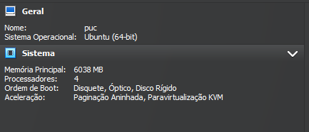

# Apache-Flume-e-Kafka

## 🚀 Introdução 

Este relatório descreve o processo de configuração e teste de um sistema utilizando Apache Kafka e Apache Flume em um ambiente de máquina virtual. O objetivo principal é criar tópicos no Kafka, produzir e consumir mensagens, e utilizar agentes do Flume para ingerir dados de um diretório de spool para um tópico do Kafka.

## ⚙️ Hardware e aplicativos utilizados

Vamos utilizar uma Maquina virtual no Virtualbox configurada com o Apache Flume e Kafka.
A maquina virtual tem as seguintes configurações.




                            
## 📖 Requisitos do Projeto 

Objetivos
1.	Configurar e iniciar um servidor Kafka.
2.	Criar tópicos no Kafka.
3.	Produzir e consumir mensagens utilizando scripts do Kafka.
4.	Configurar e executar agentes do Flume para integrar com Kafka.
5.	Validar a ingestão e consumo de dados entre Flume e Kafka.

## Procedimentos e resultados

Configurando o servidor Kafka
Executando o comando para subir o servidor

```
sudo /home/puc/kafka_2.11-1.0.0/bin/kafka-server-start.sh /home/puc/kafka_2.11-1.0.0/config/server.properties
```


Imagem