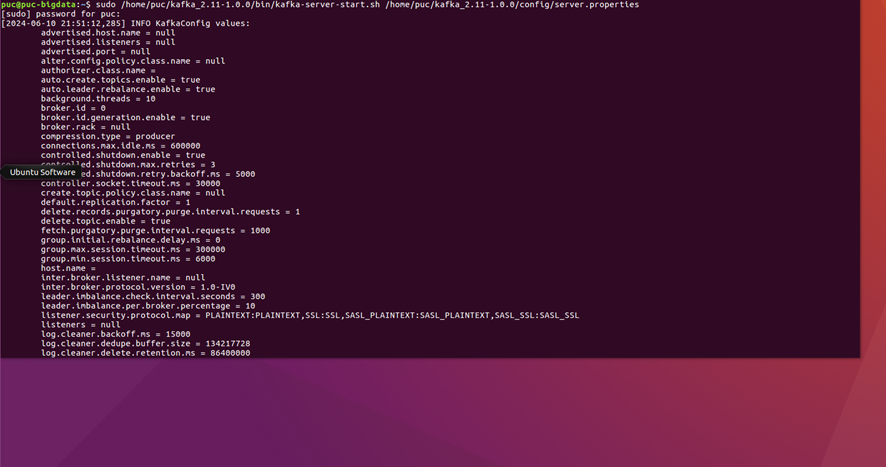
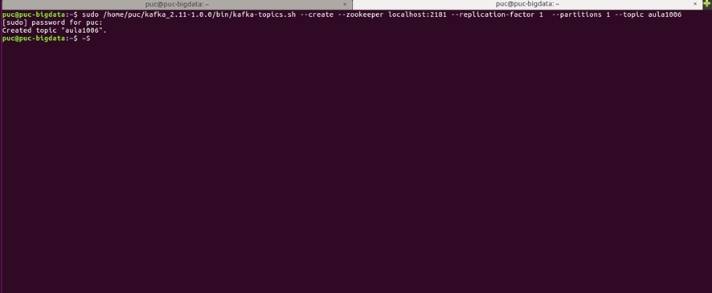
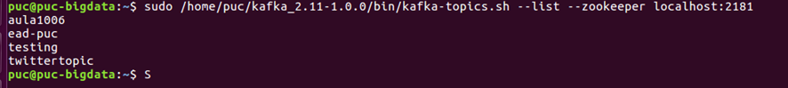
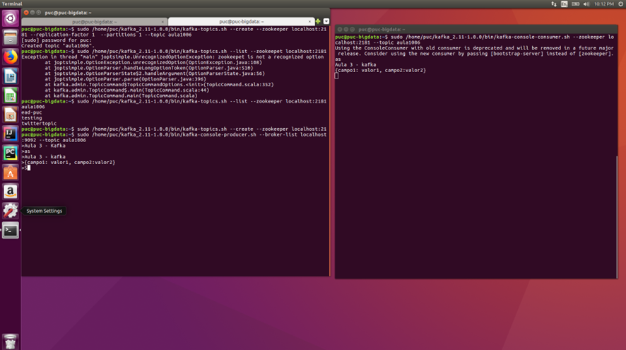
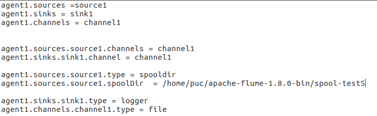
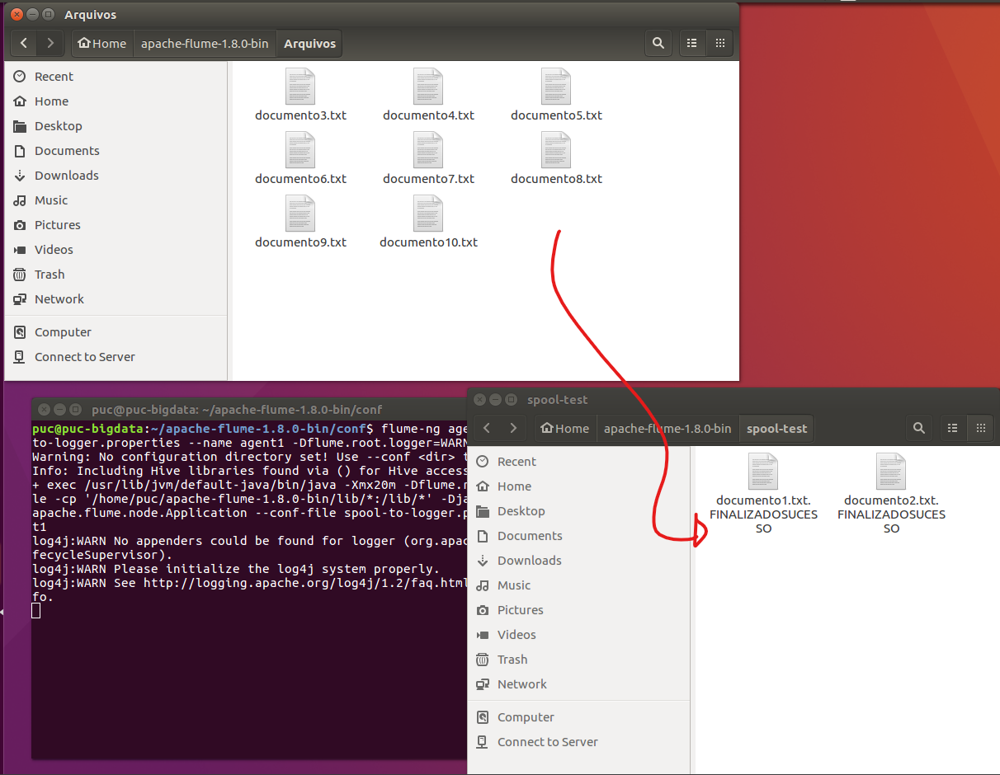

# Apache-Flume-e-Kafka

## 🚀 Introdução 

Este relatório descreve o processo de configuração e teste de um sistema utilizando Apache Kafka e Apache Flume em um ambiente de máquina virtual. O objetivo principal é criar tópicos no Kafka, produzir e consumir mensagens, e utilizar agentes do Flume para ingerir dados de um diretório de spool para um tópico do Kafka.

## ⚙️ Hardware e aplicativos utilizados

Vamos utilizar uma Maquina virtual no Virtualbox configurada com o Apache Flume e Kafka.
A maquina virtual tem as seguintes configurações.


                            
## 📖 Requisitos do Projeto 

Objetivos
1.	Configurar e iniciar um servidor Kafka.
2.	Criar tópicos no Kafka.
3.	Produzir e consumir mensagens utilizando scripts do Kafka.
4.	Configurar e executar agentes do Flume para integrar com Kafka.
5.	Validar a ingestão e consumo de dados entre Flume e Kafka.

## Procedimentos e resultados

### Configurando o servidor
Para configurar nosso servidor, vamos utilizar o seguinte comando no terminal:

```
sudo /home/puc/kafka_2.11-1.0.0/bin/kafka-server-start.sh /home/puc/kafka_2.11-1.0.0/config/server.properties
```


Obs.: É necessário manter esse terminal aberto durante a utilização do servidor.

### Criando o primeiro tópico
Para criar nosso topico, vamos abrir um novo terminal e executar o seguinte comando:

```
sudo /home/puc/kafka_2.11-1.0.0/bin/kafka-topics.sh --create --zookeeper localhost:2181 --replication-factor 1  --partitions 1 --topic aula1006
```



### Verificando topicos existentes

Para verificar os topicos existentes, vamos utilizar o comando:

```
sudo /home/puc/kafka_2.11-1.0.0/bin/kafka-topics.sh --list --zookeeper localhost:2181
```


### Enviando valores com o Producer

Para enviar mensagens, precisamos executar dois comandos, um para o Producer e outro para o Consumer

Producer:

```
sudo /home/puc/kafka_2.11-1.0.0/bin/kafka-console-producer.sh --broker-list localhost:9092 --topic aula1006
```

Consumer:

```
sudo /home/puc/kafka_2.11-1.0.0/bin/kafka-console-consumer.sh --zookeeper localhost:2181 --topic aula1006 --from-beginning 
```

Após isso, enviamos mensagens do Producer para o Consumer, como na imagem abaixo:




### Spool-to-logger

Para demonstrar o Flume, vamos criar 10 arquivos de texto aleatorios.


para configurar nosso script com o spolldir, vamos alterar o arquivo.properties da seguinte forma



Feito isso, navegue com o terminal até a pasta conf, existente no diretório do flume e abra o terminal a partir dali. no terminal execute o seguinte comando.

```
flume-ng agent --conf-file spool-to-kafka.properties --name agent1 -Dflume.root.logger=WARN,console
```

feito isso, mova os arquivos para a pasta de teste e observe o resultado




### Spool-to-kafka